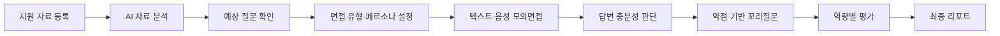
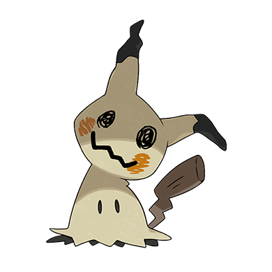
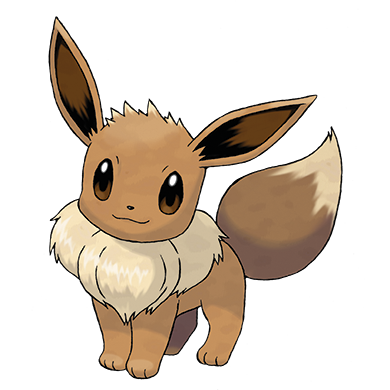
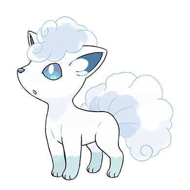
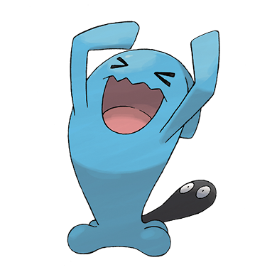
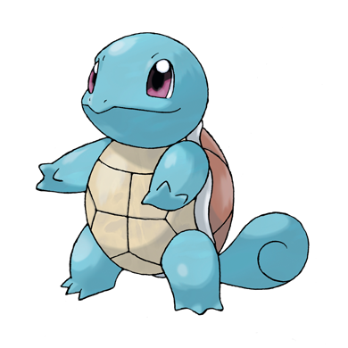
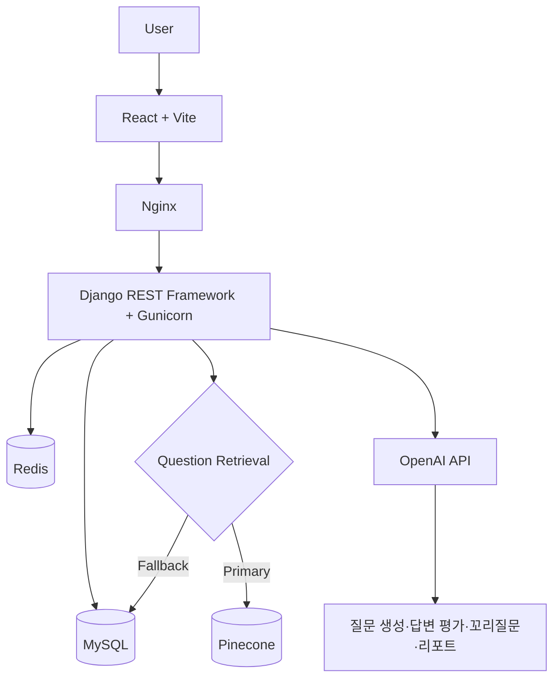
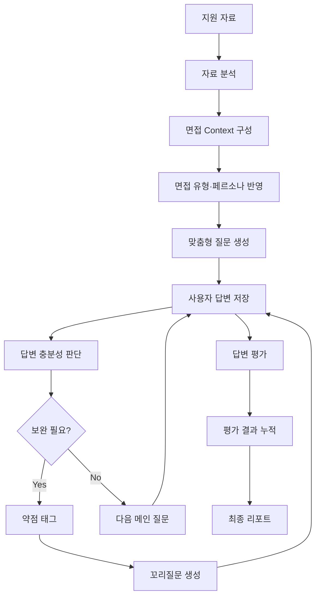
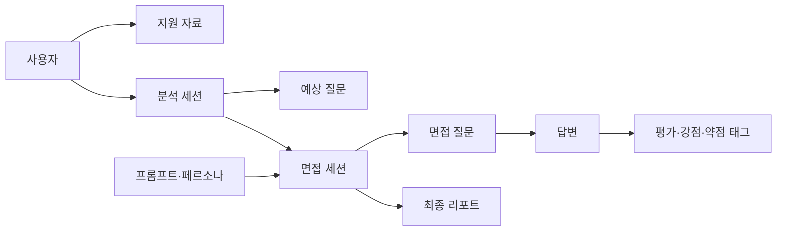

# CAREER.zip

<div align="center">

## AI 기반 IT 취업 맞춤형 모의면접 코칭 플랫폼

이력서, 자기소개서, 채용공고(JD), GitHub 프로젝트를 바탕으로  
**맞춤형 질문 생성 · 답변 평가 · 약점 기반 꼬리질문 · 최종 리포트**를 제공하는 서비스입니다.

> 면접을 반복하는 데서 끝나지 않고, 부족한 답변을 발견하고 보완하는 경험을 제공합니다.

</div>

---

## 목차

- [1. 프로젝트 개요](#1-프로젝트-개요)
  - [How to Run](#how-to-run)
- [2. 서비스 흐름](#2-서비스-흐름)
- [3. 팀 소개](#3-팀-소개)
- [4. 주요 기능](#4-주요-기능)
- [5. 기술 스택](#5-기술-스택)
- [6. 시스템 아키텍처](#6-시스템-아키텍처)
- [7. AI 면접 처리 흐름](#7-ai-면접-처리-흐름)
- [8. 데이터 구조](#8-데이터-구조)
- [9. Repository 및 실행 방법](#9-repository-및-실행-방법)
- [10. 한계 및 향후 개선 방향](#10-한계-및-향후-개선-방향)
- [11. 팀원별 회고](#11-팀원별-회고)

---

# 1. 프로젝트 개요

## 프로젝트 소개

기존 모의면접 서비스는 공통 질문이나 단순 점수 중심의 피드백에 머무르는 경우가 많아, 지원자의 실제 경험과 지원 직무를 충분히 반영하기 어렵습니다.

**CAREER.zip**은 사용자가 등록한 이력서, 자기소개서, 채용공고, 프로젝트 및 GitHub 정보를 분석하여 개인화된 면접 질문을 생성합니다. 답변 제출 후에는 충분성 판단과 약점 태깅을 거쳐 필요한 경우 꼬리질문을 생성하고, 면접 종료 후 역량별 평가와 개선 방향을 포함한 리포트를 제공합니다.

## 프로젝트 정보

| 항목 | 내용 |
|---|---|
| 프로젝트명 | CAREER.zip |
| 개발 기간 | 2026.05.22 ~ 2026.07.16 |
| 개발 형태 | 6인 팀 프로젝트 |
| 주요 대상 | IT 직무 취업 준비생 |
| 핵심 기능 | 자료 분석, 예상 질문, 모의면접, 답변 평가, 꼬리질문, 최종 리포트 |
| 저장소 구성 | Main Repository + Backend/Frontend Git Submodule |

## 목표

- 지원 자료와 채용공고를 반영한 **개인 맞춤형 질문 제공**
- 전문성·논리성·구체성·전달력 기반의 **다축 답변 평가**
- 부족한 답변을 약점 태그로 구조화한 **동적 꼬리질문 생성**
- 면접 결과를 다음 연습으로 연결하는 **성장형 리포트 제공**

## How to Run

- Service: [CAREER.zip 바로가기](https://careerdotzip.site)
- 회원가입·로그인 후 지원 자료를 등록하고, AI 분석 → 면접 설정 → 텍스트·음성 모의면접 → 최종 리포트 순서로 이용할 수 있습니다.

---

# 2. 서비스 흐름



## 서비스 미리보기

대표 화면은 다음 흐름을 중심으로 구성됩니다.

1. 이력서·자기소개서·JD·프로젝트 등록
2. 자료 분석 결과와 예상 질문 확인
3. 면접 유형·면접관 페르소나·질문 수 설정
4. 텍스트 또는 음성 모의면접 진행
5. 역량별 평가와 최종 리포트 확인

<!-- 실제 이미지 추가 후 아래 주석을 해제해 주세요.


-->

---

# 3. 팀 소개

| 캐릭터 | 이름 | 역할 | 담당 업무 | GitHub |
|---|---|---|---|---|
|  | 김이선 | 팀원 | 관리자 페이지 기능 구현 / 관리자 화면 구현 | [GitHub](https://github.com/kysuniv-cyber) |
|  | 김지윤 | 팀원 | 면접 흐름 설계 / 답변 판단·꼬리질문 로직 구현 | [GitHub](https://github.com/JiyounKim-EllyKim) |
|  | 박소윤 | PM / Backend·Frontend·DB | 프로젝트 기획·일정·API 명세·QA 총괄<br>인증·사용자 입력 API 및 화면 연동, DB 설계·데이터 전처리<br>마이페이지·포인트·가드레일 고도화, AWS 배포 설계 | [GitHub](https://github.com/parksoyun9084-cloud) |
|  | 박은지 | 팀원 | 면접 평가 기능 구현 / 리포트 생성 기능 및 화면 구현 | [GitHub](https://github.com/lo1f0306) |
|  | 위희찬 | 팀원 | STT·TTS 면접 세션 구현 / 배포·테스트 및 UI 개선 | [GitHub](https://github.com/dnlgmlcks) |
|  | 홍지윤 | 팀원 | 문서 분석 기능 구현 / 예상 질문 생성 구현 | [GitHub](https://github.com/jyh-skn) |
|  | 배현모 | 멘토 | 주제 선정 피드백 / 프로젝트 질의응답 및 방향성 자문 | - |

---

# 4. 주요 기능

## 1. 지원 자료 등록 및 분석

- 이력서 파일 업로드 및 관리
- 자기소개서와 프로젝트 경험 등록
- 채용공고 텍스트·PDF·URL 등록
- GitHub 저장소 URL 기반 README, 의존성 파일, 주요 파일 일부 분석
- 기술 키워드와 직무 요구 역량 추출
- 분석 결과를 활용한 예상 질문 생성

## 2. 예상 면접 질문

- 이력서·자기소개서의 경험 기반 질문
- JD 필수 역량과 우대사항 기반 질문
- 프로젝트와 기술 스택 기반 질문
- 질문별 답변 방향 및 참고 내용 제공
- 생성된 질문과 실제 면접 세션 연결

## 3. 맞춤형 면접 설정

| 설정 | 선택 항목 |
|---|---|
| 면접 유형 | 기술 면접, 인성 면접, 종합 면접 |
| 면접관 페르소나 | 코치형, 실무형, 검증형 |
| 질문 수 | 사용자 선택 |
| 진행 모드 | 텍스트, 음성 |

페르소나는 단순 말투뿐 아니라 질문의 깊이, 검증 방식, 피드백 방향에 반영됩니다.

## 4. 텍스트·음성 모의면접

- 텍스트 답변 입력
- OpenAI Whisper 기반 STT
- 질문 TTS 출력
- 답변 시간, pause, filler 등 일부 발화 지표 분석
- 변환된 답변 확인 및 저장

## 5. 답변 충분성 판단과 꼬리질문

답변을 저장한 뒤 질문 의도에 충분히 대응했는지 판단합니다.

```text
질문과 답변
    ↓
충분성 판단
    ↓
약점 태그 추출
    ↓
꼬리질문 필요 여부 결정
    ├─ 필요 없음 → 다음 메인 질문
    └─ 필요함   → 약점 기반 꼬리질문
```

꼬리질문은 현재 회차의 질문·답변과 감지된 약점 태그를 중심으로 생성하며, 과도한 반복을 막기 위해 생성 조건과 횟수를 제한합니다.

## 6. 역량별 답변 평가

| 평가 축 | 주요 기준 |
|---|---|
| 전문성 | 기술 개념의 정확성, 기술 선택 근거, 직무 이해 |
| 논리성 | 답변 구조, 인과관계, 질문 의도와의 일치 |
| 구체성 | 상황·역할·행동·결과와 수치 근거 |
| 전달력 | 핵심 전달, 반복 표현, 발화 흐름 |

BEI 행동 경험 구조, CBI 직무 역량, 기술 근거, 사용자 자료와의 일치 여부를 함께 참고합니다.

## 7. 최종 리포트

- 종합 점수와 역량별 점수
- 질문별 잘한 점과 보완할 점
- 강점·약점 태그
- 면접관 총평과 개선 액션
- 추천 연습 방향과 성장 로드맵
- 리포트 PDF 생성
- 토큰 기반 공유 링크 제공

## 8. 관리자 기능

구현된 범위에서 다음 운영 기능을 제공합니다.

- 회원 및 회원 상태 관리
- 포인트 정책과 이용 내역
- 프롬프트 템플릿·버전 관리
- 면접관 페르소나 관리
- 가드레일 이벤트와 관리자 감사 로그

## 핵심 차별점

- **지원자 자료 기반 질문**: 공통 질문이 아닌 이력서·JD·프로젝트 근거 기반 질문
- **답변에 반응하는 면접**: 충분성 판단과 약점 태그에 따른 동적 꼬리질문
- **IT 직무 중심 평가**: 기술 정확성, 역할, 구현 과정, 기술 선택 근거를 함께 확인

---

# 5. 기술 스택

| 영역 | 기술 |
|---|---|
| Frontend | React, Vite, React Router, Axios, TanStack Query, Zustand |
| Backend | Python, Django, Django REST Framework, JWT |
| AI | OpenAI API, Whisper STT, OpenAI TTS, LangSmith Tracing |
| Data | MySQL, Redis, Pinecone |
| Infra | Docker, Nginx, GitHub Actions, AWS EC2 |
| Collaboration | Git, GitHub, Git Submodule |

### 데이터 저장소 역할

- **MySQL**: 사용자, 지원 자료, 면접, 평가, 리포트 등 서비스 데이터
- **Redis**: 공유 캐시와 OAuth 일회용 교환 코드 등 임시 데이터
- **Pinecone**: 질문 RAG 검색
- **MySQL Keyword Fallback**: Pinecone 설정이 없거나 검색에 실패한 경우 대체 검색

> LangChain 패키지 사용은 확인되지 않아 기술 스택에서 제외하고, 실제 설정이 확인된 LangSmith tracing만 표기했습니다.

---

# 6. 시스템 아키텍처



- Frontend는 React와 Vite로 사용자 인터페이스를 제공합니다.
- Nginx는 정적 파일 제공과 Backend API reverse proxy 역할을 담당합니다.
- Backend는 Django REST Framework와 Gunicorn 기반으로 동작합니다.
- OpenAI 호출은 설정에 따라 실제 호출 또는 테스트용 mock 경로로 분리됩니다.
- 배포는 Docker Compose와 GitHub Actions를 활용해 AWS EC2 환경에서 구성했습니다.

---

# 7. AI 면접 처리 흐름



## Pipeline 구성

| 단계 | 입력 | 처리 | 출력 |
|---|---|---|---|
| 자료 분석 | 이력서, 자기소개서, JD, 프로젝트 | 기술·경험·직무 키워드 추출 | 분석 결과 |
| 질문 생성 | 분석 결과, 면접 유형, 페르소나 | 관련 자료 선택 및 질문 생성 | 메인 질문 |
| 충분성 판단 | 현재 질문과 답변 | 질문 의도 충족 여부 판정 | 충분성 상태 |
| 약점 태깅 | 질문, 답변, 충분성 결과 | 부족 요소 구조화 | 약점 태그 |
| 꼬리질문 | 현재 회차 질문·답변, 약점 태그 | 보완 질문 생성 | 꼬리질문 |
| 답변 평가 | 질문, 답변, 일부 사용자 근거 | 4축 평가 및 피드백 | 점수·강점·약점 |
| 리포트 | 세션 전체 평가 | 결과 종합 | 최종 리포트 |

## AI 안정화

- 프롬프트 인젝션과 내부 지침 유출 시도 탐지
- 면접과 무관한 사담 및 무응답 처리
- 사용자 자료에 근거가 부족한 내용의 단정 방지
- 프롬프트 템플릿·버전과 페르소나 설정의 DB 관리
- 실제 OpenAI 호출과 테스트용 mock 환경 분리
- 출력 구조 검증과 예외 처리

---

# 8. 데이터 구조

메인 README에서는 서비스의 주요 데이터 영역만 요약합니다. 모델과 ERD 상세는 Backend README에서 관리합니다.



| 데이터 영역 | 내용 |
|---|---|
| 사용자 | 계정, 프로필, 인증, 약관, 포인트 |
| 지원 자료 | 이력서, 자기소개서, JD, 프로젝트, GitHub URL |
| 분석 | 분석 세션, 키워드, 매칭 결과, 예상 질문 |
| 면접 | 세션, 질문, 답변, 면접 설정 |
| 평가 | 충분성 결과, 역량별 점수, 강점·약점 태그 |
| 리포트 | 종합 평가, 개선 액션, 공유·PDF 정보 |
| AI 관리 | 프롬프트 템플릿, 버전, 페르소나 |
| 운영 | 포인트 내역, 감사 로그, 가드레일 이벤트 |

---

# 9. Repository 및 실행 방법

## Repository 구조

```text
CAREER_DOT_ZIP/
├── CAREER_DOT_ZIP_BACKEND/    # Django REST Framework Submodule
├── CAREER_DOT_ZIP_FRONTEND/   # React + Vite Submodule
├── .github/workflows/         # GitHub Actions
├── docker-compose.prod.yml    # Production Docker Compose
├── .gitmodules
└── README.md
```

세부 개발 문서:

- [Backend README](https://github.com/SKN26-3RD-TRIP-ZIP/CAREER_DOT_ZIP_BACKEND)
- [Frontend README](https://github.com/SKN26-3RD-TRIP-ZIP/CAREER_DOT_ZIP_FRONTEND)

## 1. Clone

```bash
git clone --recurse-submodules https://github.com/SKN26-3RD-TRIP-ZIP/CAREER_DOT_ZIP.git
cd CAREER_DOT_ZIP
```

메인 저장소만 Clone한 경우:

```bash
git submodule sync --recursive
git submodule update --init --recursive
```

## 2. Backend

```bash
cd CAREER_DOT_ZIP_BACKEND

python -m venv venv

# Windows
venv\Scripts\activate

# macOS / Linux
source venv/bin/activate

pip install -r requirements.txt
python manage.py migrate
python manage.py runserver
```

환경변수는 Backend의 `.env.example`을 기준으로 설정합니다.

주요 변수:

```env
SECRET_KEY=
DEBUG=True
ALLOWED_HOSTS=
DATABASE_URL=
REDIS_URL=
OPENAI_API_KEY=
PINECONE_API_KEY=
PINECONE_INDEX_NAME=
```

테스트:

```bash
pytest
```

## 3. Frontend

```bash
cd CAREER_DOT_ZIP_FRONTEND
npm install
npm run dev
```

Frontend 환경변수는 `.env.example`을 기준으로 설정합니다.

```env
VITE_API_BASE_URL=http://localhost:8000/api/v1
```

Build:

```bash
npm run build
```

## 4. Production Docker

```bash
docker compose -f docker-compose.prod.yml up -d --build
```

종료:

```bash
docker compose -f docker-compose.prod.yml down
```

## 5. Submodule 변경 반영

각 Submodule에서 변경 사항을 먼저 Commit·Push한 뒤, 메인 저장소에서 변경된 Commit 참조를 반영합니다.

```bash
git switch -c chore/update-submodule-references
git add CAREER_DOT_ZIP_BACKEND CAREER_DOT_ZIP_FRONTEND
git commit -m "chore: update submodule references"
git push -u origin chore/update-submodule-references
```

Push 후 Pull Request를 생성해 `main` 브랜치에 반영합니다.

---

# 10. 한계 및 향후 개선 방향

## 현재 한계

| 한계 | 내용 |
|---|---|
| LLM 응답 변동성 | 동일한 입력에서도 평가 문구와 세부 결과가 달라질 수 있음 |
| GitHub 분석 범위 | README, 의존성 파일, 주요 파일 일부 중심이며 commit·PR·실제 기여도까지 판단하지 않음 |
| 음성 분석 범위 | STT와 pause·filler·duration 지표를 다루며 표정·시선·자세는 평가하지 않음 |
| 입력 자료 의존성 | 이력서·JD·프로젝트 설명이 부족하면 질문과 피드백 품질이 낮아질 수 있음 |

## 향후 개선

- 반복 약점 기반 집중 연습 세션
- Backend·Frontend·Data·AI 직무별 심화 질문팩
- 역량별 점수와 약점 변화 추이를 보여주는 성장 대시보드
- 직무·경력 수준별 고급 면접관 페르소나
- 근거 검증과 복수 평가 단계를 통한 평가 신뢰도 향상
- 명확한 동의와 보안 정책을 전제로 한 영상 면접 분석

---

# 11. 팀원별 회고

프로젝트를 진행하며 각 팀원이 경험한 문제 해결 과정과 배움을 정리했습니다.
상세 회고는 팀원별 문서에서 확인할 수 있습니다.

| 팀원 | 회고 기법 | 핵심 회고 | 상세 |
|---|---|---|---|
| 김이선 | STAR-L, 5 Whys | 어드민 기능을 구현하며 기능 완료 기준에 성능과 유지보수성 검토가 포함되어야 한다는 점을 배웠습니다. | [회고 보기](./docs/retrospectives/kim-yiseon.md) |
| 김지윤 | 성과·기여·성장, 5 Whys | AI 면접 흐름을 구현하며 개별 기능의 완성보다 기능 간 연결과 통합 안정화가 중요하다는 점을 배웠습니다. | [회고 보기](./docs/retrospectives/kim-jiyoun.md) |
| 박소윤 | STAR-L, 5 Whys, Start–Stop–Continue | PM과 Backend·Frontend·DB 업무를 수행하며 기능 구현과 검증 완료를 구분하고, 조기 E2E 통합의 중요성을 배웠습니다. | [회고 보기](./docs/retrospectives/park-soyun.md) |
| 박은지 | KPT | 평가·리포트 파이프라인을 구현하며 AI 기능의 완성도는 잘 될 때의 품질이 아니라 실패할 때의 동작으로 결정된다는 점을 배웠습니다. | [회고 보기](./docs/retrospectives/park-eunji.md) |
| 위희찬 | STAR-L, 5 Whys, Start–Stop–Continue | 음성 면접 파이프라인을 구현하고 운영 장애와 통합 오류를 해결하며, 로컬 동작을 넘어 실제 환경의 안정성과 전체 사용자 흐름을 검증하는 기준을 배웠습니다. | [회고 보기](./docs/retrospectives/wi-heechan.md) |
| 홍지윤 | KPT | AI 기능을 작은 단위로 분리하고 전체 흐름을 확인했으며, 코드 존재 여부보다 실제 호출과 검증 여부가 중요하다는 점을 배웠습니다. | [회고 보기](./docs/retrospectives/hong-jiyoon.md) |

<div align="center">

## CAREER.zip

지원자의 경험을 분석하고, 답변의 부족한 부분을 발견하며,  
다음 면접에서 더 나은 답변을 할 수 있도록 돕습니다.

</div>
